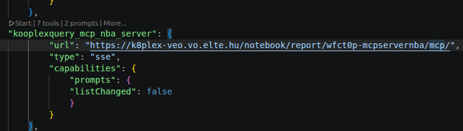
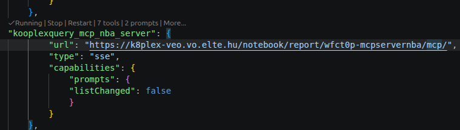
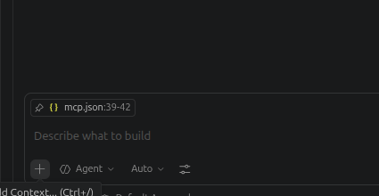
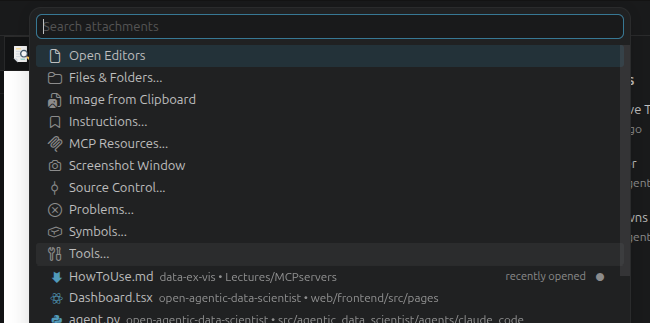
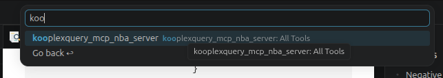
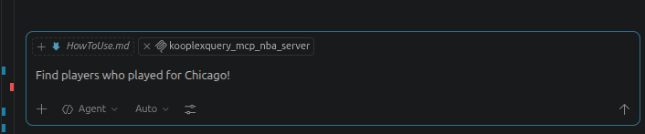

# How to use MCP servers

MCP servers are a powerful way to extend the capabilities of your language model by providing access to external tools and data sources. To use MCP servers, you need to configure them in the *mcp.json* file, which is located in the root directory of your project.

In the MCP server you can define functions/tools that guide LLM powered agents how to use resources to answer questions. For example, you can define a tool that allows the agent to query a database, or a tool that allows the agent to access a web API. The agent can then use these tools to gather information and provide more accurate and comprehensive answers to user queries.

in `mcp_server_example.py` you can find an example of how to define a simple MCP server that provides a tool for querying a database. The server is implemented using the FastMCP library, which allows you to easily create and manage MCP servers. Also prompts are defined to guide the agent on how to use the tools.

## VScode and Github Copilot integration
Below you can see how to configure and use MCP servers within the VScode environment and Github Copilot.

*mcp.json* is the configuration file for MCP servers. It contains the list of servers and their capabilities, as well as the list of inputs that can be used in the prompts. The structure of the file is as follows:

```json
{
	"servers": {
        "kooplexquery_mcp_nba_server": {
			"url": "https://k8plex-veo.vo.elte.hu/notebook/report/wfct0p-mcpservernba/mcp/",
			"type": "sse",
			"capabilities": {
				"prompts": {
				"listChanged": false
				}
			}
		},
    },
	
	"inputs": []
}
```

In VScode it should work out of the box. You will see the `Start` button above the actual entry:

After successfully connecting to the server, you will see the `Tools` listed:


Having Github Copilot enabled, you can start using the tools in your prompts. You have to click on the `+` button to add a tool to your prompt, and then select the desired tool from the list. You can also add multiple tools to the same prompt. After adding the tools, you can start writing your prompt as usual, and the tools will be available for use in the prompt.





Now you are ready to explore the database using the kooplexquery mcp tools:
